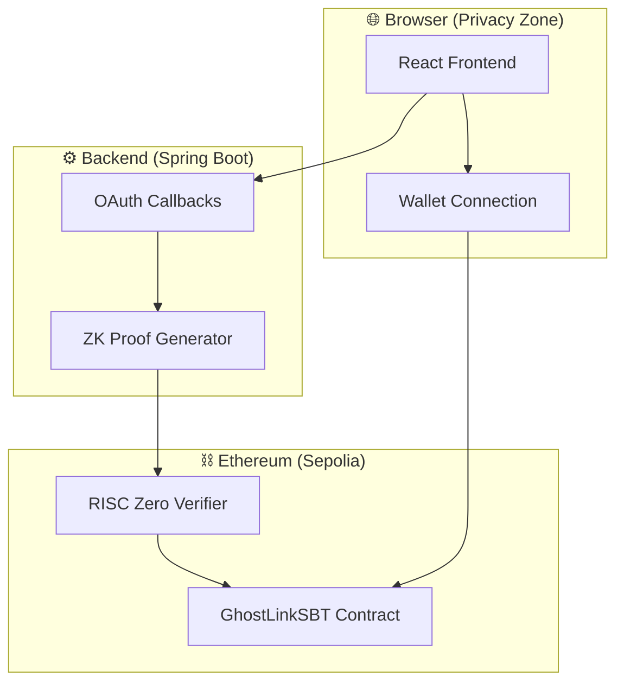

# GhostLink 👻🔗

<div align="center">


**Your Reputation, Unchained & Unseen**

[](https://opensource.org/licenses/MIT)
[](https://sepolia.etherscan.io/)
[](https://risczero.com/)

[English](README.md) | [简体中文](README.zh-CN.md) | [Live Demo](https://ghostlink.pages.dev)

</div>

---

## 🌟 What is GhostLink?

GhostLink is a **Zero-Knowledge Data Passport** that transforms your Web2 reputation into **verifiable on-chain credentials** (SBT) — **without exposing your raw data**.

> **One sentence:** Prove you meet a condition, not who you are.

### The Problem

- Web3 lacks trust signals; Web2 has abundant reputation data
- Proving credentials often requires doxxing private information
- Sybil attacks plague airdrops, allowlists, and community access

### Our Solution

GhostLink bridges this gap with **privacy-first verification**:

| What's Visible ✅ | What's Hidden ❌ |
|------------------|------------------|
| Whether you meet a requirement | Your raw account data |
| Cryptographic proof of validity | Exact balances or follower counts |
| Reusable credential on-chain | Your identity across platforms |

---

## 📸 Screenshots

<table>
<tr>
<td><br><sub>Dark Mode</sub></td>
<td><br><sub>Light Mode</sub></td>
</tr>
<tr>
<td><br><sub>ZK Privacy Bridge</sub></td>
<td><br><sub>Credential Explorer</sub></td>
</tr>
<tr>
<td colspan="2"><br><sub>Contract Inspector (Blueprint Studio)</sub></td>
</tr>
</table>

---

## ✨ Features

### 🎫 Credential Passports

- **Dev-Pass**: Prove developer credibility from GitHub (account age, contributions, repos)
- **Social-Pass**: Prove social reach from X/Twitter (followers, engagement, account age)
- **Asset-Pass**: Prove "≥ threshold" from financial data — show solvency without revealing balances

### 🛡️ Privacy & Security

- **Zero-Knowledge Proofs**: Powered by RISC Zero zkVM
- **Nullifier System**: Prevents double-claiming with cryptographic uniqueness
- **On-Chain Verification**: All proofs verified by smart contracts

### 🎨 User Experience

- **Dual Theme**: Professional dark mode & clean light mode (Blueprint aesthetic)
- **Multi-Language**: Full English & Chinese (中文) support
- **Contract Inspector**: Transparent smart contract auditing with live logic analysis
- **Real-Time Explorer**: Track credential minting and holder statistics

---

## 🏗️ Architecture



### Tech Stack

| Layer | Technology |
|-------|------------|
| Frontend | React 18 + Vite + Tailwind CSS + Framer Motion |
| Backend | Java 17 + Spring Boot 3 |
| Blockchain | Ethereum (Sepolia) + Solidity |
| ZK Proving | RISC Zero zkVM + Groth16 |
| Deployment | Cloudflare Pages + Alibaba Cloud |

---

## 🚀 Quick Start

### Prerequisites

- Node.js 18+
- Java 17+
- Maven 3.8+
- MetaMask or compatible wallet

### Frontend

```bash
cd web
npm install
npm run dev
```

Open `http://localhost:5173` in your browser.

### Backend

```bash
./mvnw spring-boot:run
```

API available at `http://localhost:8080`.

### Smart Contract

The `GhostLinkSBT` contract is deployed on Sepolia:

```
Address: 0xe62f6F1E02507880a561A8cd7a88050E61CFA4Ad
```

[View on Etherscan →](https://sepolia.etherscan.io/address/0xe62f6F1E02507880a561A8cd7a88050E61CFA4Ad)

---

## ⚙️ Configuration

### Backend Environment Variables

```bash
# OAuth Credentials (Required for production)
export GHOSTLINK_GITHUB_CLIENT_ID="your_github_client_id"
export GHOSTLINK_GITHUB_CLIENT_SECRET="your_github_client_secret"
export GHOSTLINK_TWITTER_CLIENT_ID="your_twitter_client_id"
export GHOSTLINK_TWITTER_CLIENT_SECRET="your_twitter_client_secret"
```

### Frontend Environment Variables (Optional)

```bash
# Create .env.local in /web (optional)
VITE_API_BASE_URL=http://localhost:8080
VITE_API_ZERO_URL=http://localhost:8081
VITE_GITHUB_CLIENT_ID=your_github_client_id
VITE_TWITTER_CLIENT_ID=your_twitter_client_id
```

---

## 📁 Project Structure

```
ghostlink/
├── web/                  # React Frontend
│   ├── src/
│   │   ├── components/   # Reusable UI components
│   │   ├── pages/        # Page components
│   │   ├── contexts/     # React contexts (Theme, I18n)
│   │   ├── i18n/         # Internationalization strings
│   │   └── config/       # Configuration constants
│   └── public/           # Static assets
├── src/                  # Spring Boot Backend
│   └── main/java/org/example/ghostlink/
│       ├── controller/   # REST controllers
│       ├── service/      # Business logic
│       └── config/       # Configuration
├── contracts/            # Solidity smart contracts
│   ├── GhostLinkSBT.sol  # Main SBT contract
│   └── IRiscZeroVerifier.sol
├── productdoc/           # Product specifications
└── docs/                 # Documentation & screenshots
```

---

## 📚 Documentation

| Document | Description |
|----------|-------------|
| [Product Spec](productdoc/GhostLink_Product_Spec.md) | Full product specification |
| [Smart Contract Spec](productdoc/smart_contract_spec.md) | Contract architecture & functions |
| [RISC Zero Spec](productdoc/risc_zero_spec.md) | ZK proving system design |
| [需求文档](productdoc/需求文档.md) | Chinese requirements document |

---

## 🗺️ Roadmap

- [x] **V1 MVP**: Multi-page Web UI + Demo proof flows
- [x] **Contract Inspector**: Blueprint Studio with live logic analysis
- [x] **Dual Theme**: Dark/Light mode with i18n support
- [ ] **Real Proving**: zkVM/WASM local privacy computation
- [ ] **zkTLS Integration**: Prove data authenticity from sources
- [ ] **SDK & Marketplace**: "Bring your own logic" for any dApp
- [ ] **Mobile App**: Privacy + identity in your pocket

---

## 🤝 Contributing

We welcome contributions! Here's how you can help:

1. **Star the repo** ⭐ — it helps visibility
2. **Open an Issue** — share ideas or report bugs
3. **Submit a PR** — improve code, docs, or translations

---

## 📄 License

This project is licensed under the MIT License — see the [LICENSE](LICENSE) file for details.

---

<div align="center">

**Built with 💜 by the GhostLink Team**

[Website](https://ghostlink.pages.dev) · [GitHub](https://github.com/kyp2022/ghostlink) · [Etherscan](https://sepolia.etherscan.io/address/0xe62f6F1E02507880a561A8cd7a88050E61CFA4Ad)

</div>
