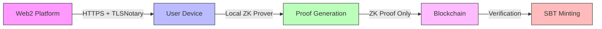
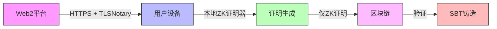

<!-- 🌟🌟🌟 GHOSTLINK - README.md 🌟🌟🌟 -->

<div align="center">

<!-- Language Switcher -->
<p>
  <a href="#english">🇺🇸 English</a> • 
  <a href="#chinese">🇨🇳 中文</a>
</p>

<!-- Hero Banner -->


<!-- Badges -->
<p>
  
  
  
  
</p>

</div>

---

<h1 id="english">🇺🇸 GhostLink - Privacy Bridge to Web3</h1>

<div align="center">

### 🎯 **Your Reputation, Unchained & Unseen**

**GhostLink** is the revolutionary **privacy bridge** that transforms your Web2 data into **verifiable on-chain credentials** using **zero-knowledge proofs**. 

> 🌉 *Bridge the gap between Web2 reputation and Web3 identity - without compromising privacy!*

</div>

## 🌟 What Makes GhostLink Magical ✨

### 🪄 **The Privacy Paradox Solver**
Imagine proving you're a **10-year GitHub veteran** 🏆, **Twitter influencer** 📱, or **high-value Alipay user** 💰 **WITHOUT** revealing:
- Your actual username
- Private transaction details  
- Personal identity information
- Specific asset amounts

**GhostLink makes this impossible dream a reality!** 🎭

### 🔮 **Zero-Knowledge Wizardry**
Using cutting-edge **RISC Zero zkVM** technology, we create **cryptographic proofs** that verify your credentials while keeping your data **completely private**. It's like showing your ID without showing your ID! 🎪

### 🌈 **Web2 → Web3 Transformation Station**
Transform your fragmented Web2 identity into a **unified, private, verifiable Web3 passport**:

| Web2 Data | 🚀 | Web3 Credential |
|-----------|---|-----------------|
| GitHub Contributions | → | 🏅 Dev-Pass SBT |
| Twitter Followers | → | 📊 Social-Pass SBT |  
| Alipay Assets | → | 💎 Asset-Pass SBT |
| Wallet History | → | ⛓️ Wallet-Pass SBT |

## 🎨 **Our Vision: The Future of Digital Identity** 🎭

> **"In a world where data is power, privacy is freedom"** 

We envision a **decentralized future** where:
- 🌍 **Everyone** controls their digital identity
- 🔐 **Privacy** is a fundamental right, not a luxury
- 🌉 **Web2 and Web3** coexist seamlessly  
- 🎯 **Reputation** is portable across platforms
- 🛡️ **Security** doesn't sacrifice usability

**GhostLink isn't just a product - it's a movement toward digital self-sovereignty!** 🚀

## 🛠️ **Tech Stack That Powers Magic** ⚡

### Frontend Wonderland 🎨
- **React 18** + **Vite** - Lightning-fast development
- **Framer Motion** - Smooth, magical animations
- **TailwindCSS** - Beautiful, responsive design
- **Ethers.js** - Web3 integration made easy
- **Next.js-style routing** - SPA with multiple pages

### Backend Powerhouse 🏭  
- **Spring Boot 3** - Robust Java backend
- **Java 21** - Latest language features
- **RESTful APIs** - Clean, scalable architecture
- **In-memory storage** - Fast, efficient data handling

### Zero-Knowledge Core 🧠
- **RISC Zero zkVM** - Cutting-edge ZK technology
- **Rust Guest Programs** - Efficient proof generation
- **zk-SNARKs** - Compact, verifiable proofs
- **TLSNotary** - Secure data verification

### Blockchain Integration ⛓️
- **Ethereum/Sepolia** - Smart contract deployment
- **Soulbound Tokens (SBTs)** - Non-transferable credentials
- **MetaMask** - User-friendly wallet integration
- **Gasless transactions** - Smooth user experience

## 🎯 **Live Features - Try Them Now!** 🚀

### 🔗 **GitHub Credential Verification**
```bash
# Connect your GitHub → Get Dev-Pass SBT
1. Click "Connect GitHub" 
2. Authorize OAuth
3. Generate ZK Proof locally 🔒
4. Mint your Dev-Pass NFT! 🎨
```

### 📱 **Twitter/X Social Verification** 
```bash
# Prove social influence → Get Social-Pass SBT
1. Connect Twitter/X account
2. Verify follower count privately 🔐
3. Mint Social-Pass credential! 🌟
```

### 💰 **Alipay Asset Verification**
```bash
# Prove financial standing → Get Asset-Pass SBT
1. Upload Alipay statement PDF 📄
2. ZK proof verifies assets ≥ threshold 💎
3. Mint Asset-Pass without revealing amount! 🏦
```

### ⛓️ **On-chain Asset Verification**
```bash
# Verify wallet holdings → Get Wallet-Pass SBT
1. Connect MetaMask 🔗
2. Sign verification message ✍️
3. Prove wallet activity & balance! 💼
```

## 🌟 **Why GhostLink Changes Everything** 🌟

### For Users 👥
- **🛡️ Privacy-First**: Your data never leaves your device
- **🎭 Anonymous but Verified**: Prove credentials without doxxing
- **🌉 Cross-Platform**: One identity, many platforms
- **💎 Own Your Reputation**: Portable, verifiable credentials

### For Projects & DAOs 🏢
- **🛡️ Sybil-Resistant**: Filter out bot accounts
- **🎯 Quality Users**: Attract verified, valuable community members  
- **💰 Better Targeting**: Understand your users without surveillance
- **🚀 Growth Hacking**: Incentivize real user engagement

### For DeFi & Lending 💸
- **🏦 Credit Scoring**: Under-collateralized loans based on reputation
- **📊 Risk Assessment**: Multi-dimensional user profiling
- **🌍 Global Access**: Financial services for the unbanked
- **🔐 Privacy-Preserving**: No need to share sensitive financial data

## 🎪 **The Technology Magic Show** 🎪

### 🧙‍♂️ **Zero-Knowledge Proof Generation**
```mermaid
graph TD
    A[User Data] -->|Local Processing| B[RISC Zero zkVM]
    B -->|Cryptographic Magic| C[ZK Proof Generated]
    C -->|Public Input| D[Journal: "Verified ✓"]
    C -->|Private Input| E[Your Data: "Hidden 🔒"]
    D -->|On-Chain| F[Smart Contract]
    F -->|Verification| G[SBT Minted! 🎨]
```

### 🌈 **Privacy-Preserving Architecture**


## 🚀 **Quick Start - Get Started in 5 Minutes!** ⚡

### Prerequisites 📋
- Node.js 18+ 
- Java 21+
- MetaMask wallet
- GitHub/Twitter account (for testing)

### 🏃‍♂️ **Lightning Setup**
```bash
# Clone the magic
git clone https://github.com/your-username/ghostlink.git
cd ghostlink

# Start the backend (Spring Boot)
./mvnw spring-boot:run

# In another terminal, start the frontend
cd web
npm install
npm run dev

# 🎉 Magic happens at http://localhost:5173!
```

### 🔗 **Connect Your Identity**
1. Visit `http://localhost:5173`
2. Connect MetaMask wallet
3. Choose your verification type (GitHub/Twitter/Alipay/Wallet)
4. Follow the guided flow
5. Mint your first private credential! 🎨

## 🎯 **Roadmap: The Journey Ahead** 🗺️

### 🌟 **Phase 1: Foundation** ✅
- [x] Core ZK infrastructure
- [x] Basic credential types (GitHub, Twitter, Alipay, Wallet)
- [x] Web interface with i18n support
- [x] Smart contract deployment

### 🚀 **Phase 2: Expansion** 🚧
- [ ] **Mobile App** - Native iOS/Android experience
- [ ] **More Platforms** - LinkedIn, Steam, Discord, Reddit
- [ ] **Advanced ZK** - Complex logical proofs
- [ ] **Enterprise API** - B2B integration tools

### 🌈 **Phase 3: Ecosystem** 📈
- [ ] **SDK Launch** - Build your own ZK credentials
- [ ] **Marketplace** - Trade/borrow reputation
- [ ] **Cross-Chain** - Multi-blockchain support
- [ ] **Governance** - DAO for protocol decisions

### 🌍 **Phase 4: Global Adoption** 🌐
- [ ] **Real-World Integration** - Government ID, academic credentials
- [ ] **DeFi Partnerships** - Major lending protocols
- [ ] **Gaming Integration** - Web3 gaming credentials
- [ ] **Universal Identity** - One identity for Web3

## 🤝 **Join the Privacy Revolution!** 🚀

GhostLink is more than code - it's a **movement toward digital freedom**. Here's how you can help:

### 🛠️ **For Developers**
- 🐛 Report bugs and suggest features
- 🔧 Contribute code and improvements  
- 📚 Improve documentation
- 🧪 Test new features

### 🎨 **For Designers**
- 🖼️ Create beautiful credential designs
- 🎨 Improve UI/UX experience
- 📱 Design mobile interfaces

### 🌍 **For Community**
- 📢 Spread the word about privacy
- 🌟 Share your GhostLink credentials
- 🤝 Help onboard new users
- 💡 Suggest new credential types

### 💼 **For Partners**
- 🤝 Integrate GhostLink into your project
- 🏢 Enterprise solutions and custom credentials
- 🚀 Joint marketing and growth initiatives

## 📞 **Get In Touch** 📧

- 💬 **Discord**: [Join our community](https://discord.gg/ghostlink)
- 🐦 **Twitter**: [@GhostLinkZK](https://twitter.com/GhostLinkZK)
- 📧 **Email**: hello@ghostlink.io
- 🌐 **Website**: [https://ghostlink.io](https://ghostlink.io)

---

<div align="center">

### 🌟 **Star This Repo If You Believe in Privacy!** 🌟

**⭐ Click the star button above to support the privacy revolution! ⭐**

<p>
  
</p>

**Built with ❤️, 🔒 privacy, and ⚡ zero-knowledge magic**

</div>

---

<h1 id="chinese">🇨🇳 GhostLink - 通往Web3的隐私桥梁</h1>

<div align="center">

### 🎯 **您的声誉，无需暴露，自由流转**

**GhostLink** 是革命性的**隐私桥梁**，将您的Web2数据转化为**可验证的链上凭证**，使用**零知识证明技术**。

> 🌉 *在Web2声誉和Web3身份之间架起桥梁 - 无需妥协隐私！*

</div>

## 🌟 GhostLink的魔法所在 ✨

### 🪄 **隐私悖论解决者**
想象可以证明您是**10年GitHub老兵**🏆、**Twitter影响者**📱、或**高价值支付宝用户**💰，**同时无需透露**：
- 您的真实用户名
- 私人交易详情
- 个人身份信息  
- 具体资产金额

**GhostLink让这种不可能的梦想成为现实！** 🎭

### 🔮 **零知识魔法**
使用尖端的**RISC Zero zkVM**技术，我们创建**加密证明**，验证您的凭证同时保持数据**完全私密**。就像出示ID而不展示ID！ 🎪

### 🌈 **Web2 → Web3转换站**
将您分散的Web2身份转化为**统一的、私密的、可验证的Web3护照**：

| Web2数据 | 🚀 | Web3凭证 |
|-----------|---|-----------------|
| GitHub贡献 | → | 🏅 Dev-Pass SBT |
| Twitter粉丝 | → | 📊 Social-Pass SBT |
| 支付宝资产 | → | 💎 Asset-Pass SBT |
| 钱包历史 | → | ⛓️ Wallet-Pass SBT |

## 🎨 **我们的愿景：数字身份的未来** 🎭

> **"在数据即权力的世界中，隐私就是自由"**

我们设想一个**去中心化未来**，其中：
- 🌍 **每个人**都掌控自己的数字身份
- 🔐 **隐私**是基本权利，而非奢侈品
- 🌉 **Web2和Web3**无缝共存
- 🎯 **声誉**可在平台间携带
- 🛡️ **安全**不以牺牲可用性为代价

**GhostLink不仅是产品 - 更是走向数字主权的运动！** 🚀

## 🛠️ **驱动魔法的技本栈** ⚡

### 前端仙境 🎨
- **React 18** + **Vite** - 闪电般快速的开发
- **Framer Motion** - 流畅、神奇的动画
- **TailwindCSS** - 美丽、响应式设计
- **Ethers.js** - 轻松的Web3集成
- **Next.js风格路由** - 带多页面的SPA

### 后端动力站 🏭
- **Spring Boot 3** - 强大的Java后端
- **Java 21** - 最新语言特性
- **RESTful APIs** - 清晰、可扩展架构
- **内存存储** - 快速、高效的数据处理

### 零知识核心 🧠
- **RISC Zero zkVM** - 尖端ZK技术
- **Rust客户程序** - 高效证明生成
- **zk-SNARKs** - 紧凑、可验证证明
- **TLSNotary** - 安全数据验证

### 区块链集成 ⛓️
- **以太坊/Sepolia** - 智能合约部署
- **灵魂绑定代币(SBTs)** - 不可转移凭证
- **MetaMask** - 用户友好的钱包集成
- **无Gas交易** - 流畅用户体验

## 🎯 **实时功能 - 立即尝试！** 🚀

### 🔗 **GitHub凭证验证**
```bash
# 连接GitHub → 获取Dev-Pass SBT
1. 点击"连接GitHub"
2. 授权OAuth
3. 本地生成ZK证明 🔒
4. 铸造您的Dev-Pass NFT！ 🎨
```

### 📱 **Twitter/X社交验证**
```bash
# 证明社交影响力 → 获取Social-Pass SBT
1. 连接Twitter/X账户
2. 私密验证粉丝数 🔐
3. 铸造Social-Pass凭证！ 🌟
```

### 💰 **支付宝资产验证**
```bash
# 证明财务状况 → 获取Asset-Pass SBT
1. 上传支付宝对账单PDF 📄
2. ZK证明验证资产 ≥ 门槛 💎
3. 不透露金额铸造Asset-Pass！ 🏦
```

### ⛓️ **链上资产验证**
```bash
# 验证钱包持有 → 获取Wallet-Pass SBT
1. 连接MetaMask 🔗
2. 签署验证消息 ✍️
3. 证明钱包活动和余额！ 💼
```

## 🌟 **为什么GhostLink改变一切** 🌟

### 对于用户 👥
- **🛡️ 隐私优先**：您的数据永不离设备
- **🎭 匿名但可验证**：证明凭证而不暴露身份
- **🌉 跨平台**：一个身份，多个平台
- **💎 拥有您的声誉**：可携带、可验证凭证

### 对于项目和DAO 🏢
- **🛡️ 抗女巫攻击**：过滤机器人账户
- **🎯 优质用户**：吸引经过验证、有价值的社区成员
- **💰 更好定位**：无需监控即可了解用户
- **🚀 增长黑客**：激励真实用户参与

### 对于DeFi和借贷 💸
- **🏦 信用评分**：基于声誉的不足额抵押贷款
- **📊 风险评估**：多维度用户画像
- **🌍 全球准入**：为无银行账户者提供金融服务
- **🔐 保护隐私**：无需分享敏感财务数据

## 🎪 **技术魔法秀** 🎪

### 🧙‍♂️ **零知识证明生成**
```mermaid
graph TD
    A[用户数据] -->|本地处理| B[RISC Zero zkVM]
    B -->|加密魔法| C[生成ZK证明]
    C -->|公开输入| D[日志："已验证 ✓"]
    C -->|私密输入| E[您的数据："隐藏 🔒"]
    D -->|链上| F[智能合约]
    F -->|验证| G[SBT铸造！ 🎨]
```

### 🌈 **保护隐私架构**


## 🚀 **快速开始 - 5分钟上手！** ⚡

### 前置条件 📋
- Node.js 18+
- Java 21+
- MetaMask钱包
- GitHub/Twitter账户（用于测试）

### 🏃‍♂️ **闪电设置**
```bash
# 克隆魔法
git clone https://github.com/your-username/ghostlink.git
cd ghostlink

# 启动后端（Spring Boot）
./mvnw spring-boot:run

# 在另一个终端，启动前端
cd web
npm install
npm run dev

# 🎉 魔法发生在 http://localhost:5173！
```

### 🔗 **连接您的身份**
1. 访问 `http://localhost:5173`
2. 连接MetaMask钱包
3. 选择验证类型（GitHub/Twitter/支付宝/钱包）
4. 跟随引导流程
5. 铸造您的第一个私密凭证！ 🎨

## 🎯 **路线图：前方旅程** 🗺️

### 🌟 **阶段1：基础** ✅
- [x] 核心ZK基础设施
- [x] 基本凭证类型（GitHub、Twitter、支付宝、钱包）
- [x] 带i18n支持的Web界面
- [x] 智能合约部署

### 🚀 **阶段2：扩展** 🚧
- [ ] **移动应用** - 原生iOS/Android体验
- [ ] **更多平台** - LinkedIn、Steam、Discord、Reddit
- [ ] **高级ZK** - 复杂逻辑证明
- [ ] **企业API** - B2B集成工具

### 🌈 **阶段3：生态系统** 📈
- [ ] **SDK发布** - 构建您自己的ZK凭证
- [ ] **市场** - 交易/借入声誉
- [ ] **跨链** - 多区块链支持
- [ ] **治理** - 协议决策DAO

### 🌍 **阶段4：全球采用** 🌐
- [ ] **现实世界集成** - 政府ID、学术凭证
- [ ] **DeFi合作伙伴** - 主要借贷协议
- [ ] **游戏集成** - Web3游戏凭证
- [ ] **通用身份** - Web3的一个身份

## 🤝 **加入隐私革命！** 🚀

GhostLink不仅是代码 - 更是**走向数字自由的运动**。以下是您可以帮助的方式：

### 🛠️ **对于开发者**
- 🐛 报告错误和建议功能
- 🔧 贡献代码和改进
- 📚 改进文档
- 🧪 测试新功能

### 🎨 **对于设计师**
- 🖼️ 创建美丽的凭证设计
- 🎨 改进UI/UX体验
- 📱 设计移动界面

### 🌍 **对于社区**
- 📢 传播隐私理念
- 🌟 分享您的GhostLink凭证
- 🤝 帮助引导新用户
- 💡 建议新凭证类型

### 💼 **对于合作伙伴**
- 🤝 将GhostLink集成到您的项目
- 🏢 企业解决方案和定制凭证
- 🚀 联合营销和增长计划

## 📞 **联系我们** 📧

- 💬 **Discord**：[加入我们的社区](https://discord.gg/ghostlink)
- 🐦 **Twitter**：[@GhostLinkZK](https://twitter.com/GhostLinkZK)
- 📧 **邮箱**：hello@ghostlink.io
- 🌐 **网站**：[https://ghostlink.io](https://ghostlink.io)

---

<div align="center">

### 🌟 **如果您相信隐私，就为这个仓库点星！** 🌟

**⭐ 点击上方的星号按钮支持隐私革命！ ⭐**

<p>
  
</p>

**用❤️、🔒隐私和⚡零知识魔法构建**

</div>

---

## 📄 **许可证** 📄

本项目采用MIT许可证 - 详见 [LICENSE](LICENSE) 文件

## 🙏 **致谢** 🙏

- **RISC Zero团队** - 卓越的ZK技术
- **以太坊社区** - 去中心化愿景
- **所有贡献者** - 让这个项目成为可能
- **您** - 相信隐私的力量

---

<div align="center">
  <p>
    <b>让隐私可编程 · 让声誉可验证 · 让身份自主</b>
  </p>
  <p>
    <i>Made with ❤️ for the decentralized future</i>
  </p>
</div>