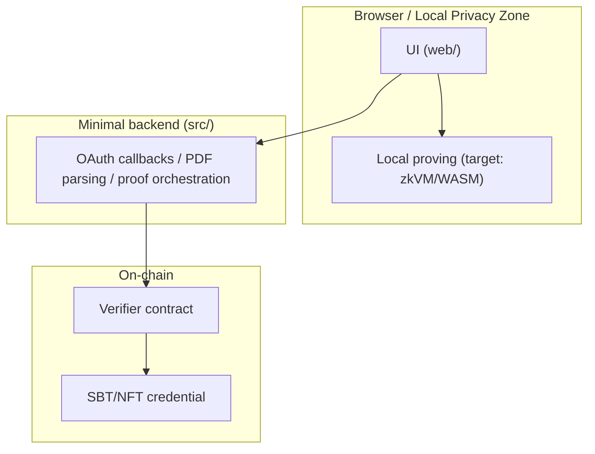

# GhostLink 👻🔗

[English](README.md) | [简体中文](README.zh-CN.md)

**GhostLink** is a “Zero-Knowledge Data Passport” prototype: turn your Web2 signals into **verifiable on-chain credentials** (SBT/NFT) — **without exposing raw data**.  
One sentence: **prove you meet a condition, not who you are.** 🕶️✨

> Slogan: Your Reputation, Unchained & Unseen.

---

## The “Why” 🌉

Web3 lacks trust, while Web2 is full of reputation. GhostLink connects them — **privacy-first**:

- 🧙 Prove you’re a real developer / real human / above an asset threshold — without doxxing accounts, statements, or exact numbers
- 🛡️ Help projects run airdrops, allowlists, and access control with less Sybil pain
- 🧩 Make off-chain signals composable on-chain (permissions, gating, identity layers)

Big vision: **data becomes programmable private property, reputation becomes verifiable public capability.** 🧠⚙️

---

## What you can imagine building 🚀

Not “features list”, but “product imagination list”:

- 🏅 Dev-Pass: prove developer credibility from GitHub signals (age, contributions, merges…)
- 📣 Social-Pass: prove social reach from X/Twitter signals (followers, account age…)
- 💎 Asset-Pass: prove “≥ threshold” from statements — **show solvency without showing balances**
- 🧷 Sybil Guard: one-person-one-claim via `nullifier` (no repeated minting / claiming)
- 🧱 Private allowlists: events, communities, beta programs, RWA access, DeFi credit primitives

Some of these are in prototype UI/flows today; others are the intended direction (see roadmap + `productdoc/`).

---

## The core trick: visibility vs. invisibility 🎭

GhostLink doesn’t “move data”, it “moves conclusions”:

- ✅ Public: whether a requirement is met
- ❌ Private: raw data (accounts, transaction details, exact amounts)
- 🔁 Reusable: third parties verify a credential, not your entire life
- 🧷 Anti-replay: `nullifier` prevents “same identity, multiple mints”

---

## Web-First architecture (local privacy zone) 🧩

We lean toward **Thick Client, Thin Server**: keep privacy computation on the user side, keep the server minimal.



In this repo, proof generation currently runs in **demo mode** (mock proof) to validate product flows and UX. The target ZK + on-chain design is documented in `productdoc/`.

---

## Why zkVM + zkTLS? 🧬

GhostLink’s design docs assume a future where:

- ⚙️ A general-purpose zkVM (e.g. RISC Zero) runs **real parsing + verification logic** in standard Rust
- 📄 We can handle not only neat JSON, but also messy HTML / PDFs (the real world is unstructured)
- 🔁 Verification logic can evolve quickly (update rules, not rewrite circuits from scratch)
- 🛰️ zkTLS (e.g. TLSNotary-style attestation) can prove the data truly came from a website/API without trusting the user or the server

The repo focuses on **product UX + end-to-end flow** first, then swaps the proof engine underneath when ready. 🪄

---

## Screenshots (drop yours here) 📸

Put images under `docs/screenshots/` and they will show up:


More slots + recommended filenames: `docs/screenshots/README.md`

---

## Quick start ⚡

### Backend (Java)

```bash
./mvnw spring-boot:run
```

Default port: `8080`

### Frontend (Vite)

```bash
cd web
npm install
npm run dev
```

The terminal prints the local URL (commonly `http://localhost:5173`).

---

## Configuration (please do this before going public) 🔐

Backend OAuth reads env vars (no secrets in source control):

- `GHOSTLINK_GITHUB_CLIENT_ID`
- `GHOSTLINK_GITHUB_CLIENT_SECRET`
- `GHOSTLINK_TWITTER_CLIENT_ID`
- `GHOSTLINK_TWITTER_CLIENT_SECRET`

Frontend supports optional Vite overrides:

- `VITE_GITHUB_CLIENT_ID`
- `VITE_TWITTER_CLIENT_ID`

---

## Product / Protocol docs 📚

- `productdoc/GhostLink_Product_Spec.md`
- `productdoc/需求文档.md`
- `productdoc/risc_zero_spec.md`
- `productdoc/smart_contract_spec.md`

---

## Roadmap (star first, ship next) 🗺️✨

- ✅ Web MVP: multi-page product UI + flows + demo proof plumbing
- 🚧 Real proving: zkVM/WASM, local privacy computation, auditable rules
- 🚧 zkTLS: prove the data source is authentic + untampered
- 🌈 SDK & marketplace: “bring your own logic” for any dApp
- 📱 Mobile: privacy + identity in your pocket

---

## Join us 🤝

If this direction resonates, please give the repo a ⭐️ — it’s the fastest way to turn a privacy vision into real infrastructure.  
Open an Issue with the one condition you wish you could prove… privately 👀
