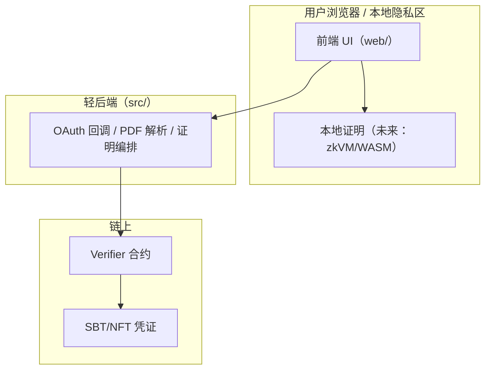
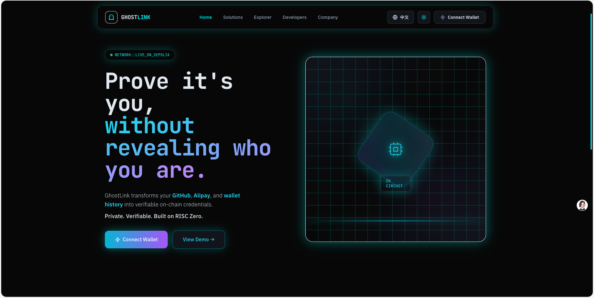
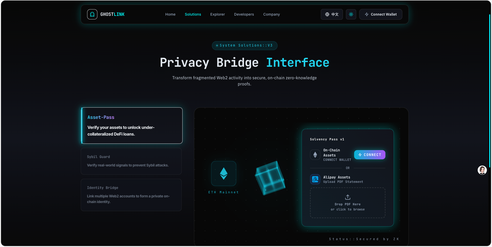
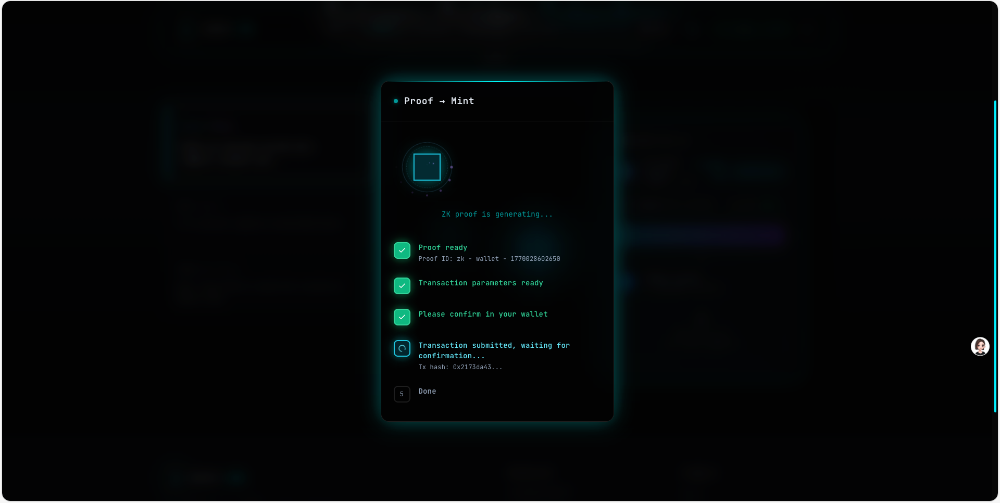
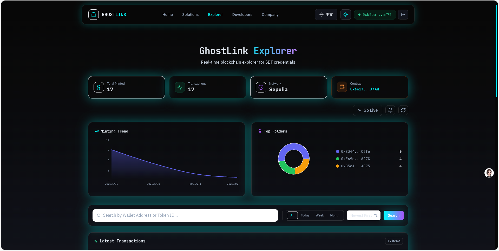

# GhostLink 👻🔗

[简体中文](README.zh-CN.md) | [English](README.md)

**GhostLink** 是一个“去中心化零知识数据护照”原型：把你的 Web2 行为/资产信号，变成 **链上可验证、但不泄露原始数据** 的凭证（SBT/NFT）。  
一句话：**证明你“满足条件”，而不是暴露你“是谁/有什么”。** 🕶️✨

> 口号：Your Reputation, Unchained & Unseen.

---

## 为什么会有 GhostLink？🌉

Web3 世界缺的是“可信”，而 Web2 世界堆满了“声誉”。  
GhostLink 想把两者接起来，同时不牺牲隐私：

- 🧙 你可以证明“我是老牌开发者 / 真人 / 有资产门槛”，但不必公开你的账号、流水、具体金额
- 🛡️ 项目方可以用更温和的方式防女巫、做白名单、发空投、做准入
- 🧩 dApp 可以把“链下信号”变成“链上可组合的权限与资产”

更大的愿景是：**把“数据”变成可编程的私人资产，把“声誉”变成可验证的公共能力。** 🧠⚙️

---

## 你可以想象用它做什么？🚀

这不是“接口清单”，而是一份“产品想象清单”：

- 🏅 Dev-Pass：用 GitHub 信号证明开发者可信度（账号年龄、贡献度、合并记录等）
- 📣 Social-Pass：用 X/Twitter 信号证明影响力（粉丝、账号年龄等）
- 💎 Asset-Pass：用账单证明“≥ 阈值”——**只证明门槛，不暴露余额**
- 🧷 Sybil Guard：用 `nullifier` 做“一人一次”的空投/准入/领奖
- 🧱 私人白名单：活动、社群、内测、RWA、DeFi 信用等场景的隐私准入

其中一部分在当前网页原型里已经呈现了交互流程；更完整的目标与规范见 `productdoc/`。

---

## 核心创意：数据护照的“可见/不可见”🎭

GhostLink 的核心不是“搬运数据”，而是“搬运结论”：

- ✅ 公开：你是否满足某个门槛（例如账户年龄、贡献度、资产阈值）
- ❌ 不公开：你的原始数据（账号、明细、金额、历史记录）
- 🔁 可复用：第三方只需要验证链上凭证，不需要重新收集你的一切
- 🧷 防重复：用 `nullifier` 避免同一身份重复铸造/重复领奖

---

## 它怎么工作？（Web-First 思路）🧩

我们偏向 **“重客户端、轻服务端”**：把隐私计算尽量留在用户侧，把服务端做成最小必要的转发/验证层。



当前仓库里，证明部分以“演示模式”跑通（mock proof），用于打通 UI/流程/交互；产品设计目标与对接规范在 `productdoc/`。

---

## 为什么要用 zkVM + zkTLS？🧬

GhostLink 的设计文档指向一个更“可扩展”的未来：

- ⚙️ 用通用 zkVM（例如 RISC Zero）在标准 Rust 里跑**真实解析 + 真实校验逻辑**
- 📄 不只处理规整的 JSON，也能处理更现实的 HTML / PDF（世界本来就不结构化）
- 🔁 规则可以快速演进（改规则，不用每次都“重写电路”）
- 🛰️ 用 zkTLS（例如 TLSNotary 思路）证明“数据确实来自某网站/API 且未被篡改”，减少对用户与服务端的信任假设

这个仓库的策略是：先把 **产品体验 + 端到端流程** 做到顺滑，再把证明引擎像“换电池”一样替换到位。🪄

---

## 它看起来像什么？（建议你放截图）📸

把截图放到 `docs/screenshots/` 后，README 会自动展示：






更多截图位与命名建议：`docs/screenshots/README.md`

---

## 快速开始（本地跑起来）⚡

### 1）启动后端（Java）

```bash
./mvnw spring-boot:run
```

默认端口：`8080`

### 2）启动前端（Vite）

```bash
cd web
npm install
npm run dev
```

默认地址：终端会输出本地访问地址（通常是 `http://localhost:5173`）。

---

## 配置说明（建议你发版前一定做）🔐

为了避免把密钥提交到仓库，后端 OAuth 已改为读取环境变量：

- `GHOSTLINK_GITHUB_CLIENT_ID`
- `GHOSTLINK_GITHUB_CLIENT_SECRET`
- `GHOSTLINK_TWITTER_CLIENT_ID`
- `GHOSTLINK_TWITTER_CLIENT_SECRET`

前端支持用 Vite 环境变量覆盖（可选）：

- `VITE_GITHUB_CLIENT_ID`
- `VITE_TWITTER_CLIENT_ID`

---

## 设计原则（我们坚持什么）🧭

- 🔒 隐私优先：默认不收集、不上传、不留存原始数据
- 🧪 可审计：把验证逻辑写成“可读的规则”，而不是黑盒
- 🧩 可组合：凭证上链后能被更多 dApp 复用
- 🧠 结论优先：只公开“是否满足条件”，不公开“具体细节”
- 🌍 体验优先：把复杂密码学藏在“像魔法一样顺滑”的交互后面 ✨

---

## 设计文档 / 产品规格 📚

如果你想从“产品愿景 → 技术方案 → 路线图”快速理解 GhostLink：

- `productdoc/GhostLink_Product_Spec.md`
- `productdoc/需求文档.md`
- `productdoc/risc_zero_spec.md`
- `productdoc/smart_contract_spec.md`

---

## 路线图（欢迎先点赞再催更）🗺️✨

- ✅ Web MVP：多页面官网 + 交互流程 + 演示证明链路
- 🚧 接入真实证明：zkVM/WASM、本地隐私计算、可审计规则
- 🚧 zkTLS：把“数据来自某网站且未被篡改”也纳入证明
- 🌈 SDK/市场：让任何 dApp 都能定义自己的“护照规则”
- 📱 移动端：把身份与隐私计算带到更贴身的设备里

---

## 加入我们 🤝

如果你认同这个方向，请给一个 ⭐️：这会直接决定我们能不能把“隐私的愿景”变成“可用的基础设施”。  
也欢迎提 Issue：你最想证明的“那个条件”是什么？👀
