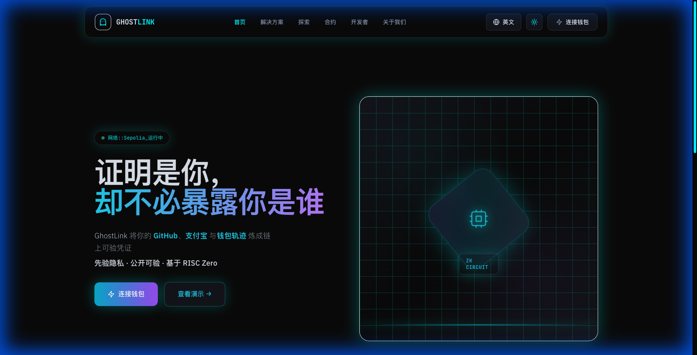
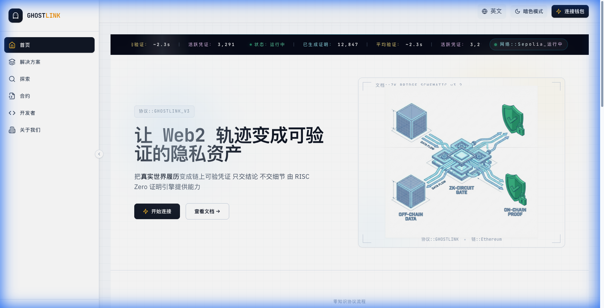
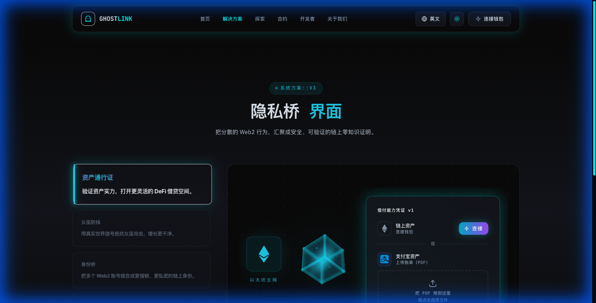
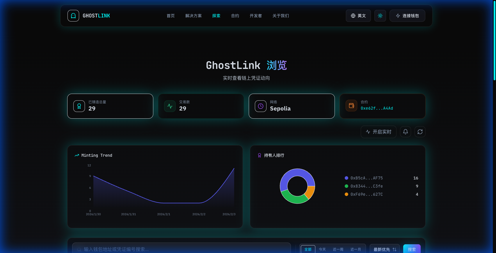
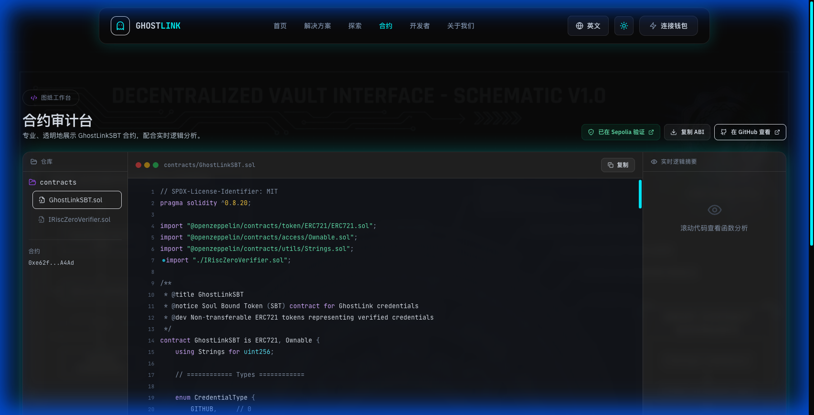
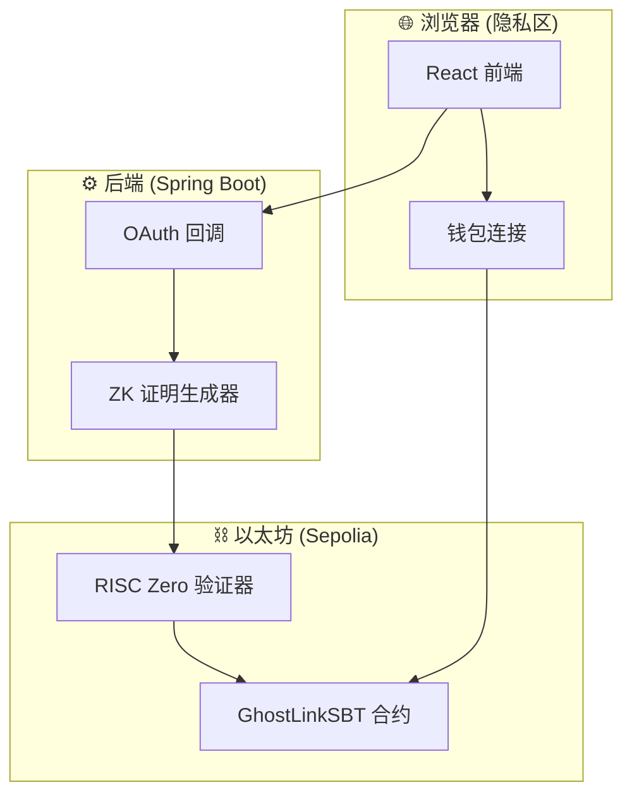

# GhostLink 👻🔗

<div align="center">



**你的声誉，解放且隐形**

[](https://opensource.org/licenses/MIT)
[](https://sepolia.etherscan.io/)
[](https://risczero.com/)

[English](README.md) | [简体中文](README.zh-CN.md) | [在线演示](https://ghostlink.pages.dev)

</div>

---

## 🌟 什么是 GhostLink？

GhostLink 是一个**零知识数据护照**，将你的 Web2 声誉转化为**可验证的链上凭证** (SBT) — **无需暴露原始数据**。

> **一句话概括：** 证明你符合条件，而非证明你是谁。

### 问题

- Web3 缺乏信任信号；Web2 拥有丰富的声誉数据
- 验证凭证往往需要暴露私人信息
- 空投、白名单和社区准入饱受女巫攻击困扰

### 我们的解决方案

GhostLink 以**隐私优先**的方式弥合这一鸿沟：

| 可见内容 ✅ | 隐藏内容 ❌ |
|-------------|-------------|
| 是否满足某项要求 | 你的原始账户数据 |
| 有效性的密码学证明 | 确切的余额或粉丝数量 |
| 链上可复用的凭证 | 你在各平台的身份 |

---

## 📸 界面预览

<table>
<tr>
<td><br><sub>暗色模式</sub></td>
<td><br><sub>亮色模式</sub></td>
</tr>
<tr>
<td><br><sub>ZK 隐私桥</sub></td>
<td><br><sub>凭证探索器</sub></td>
</tr>
<tr>
<td colspan="2"><br><sub>合约审计台 (图纸工作室)</sub></td>
</tr>
</table>

---

## ✨ 核心功能

### 🎫 凭证护照

- **Dev-Pass**: 通过 GitHub 证明开发者可信度（账户年龄、贡献、仓库）
- **Social-Pass**: 通过 X/Twitter 证明社交影响力（粉丝数、互动、账户年龄）
- **Asset-Pass**: 证明 "≥ 阈值" — 展示偿付能力而不暴露余额

### 🛡️ 隐私与安全

- **零知识证明**: 由 RISC Zero zkVM 驱动
- **Nullifier 机制**: 通过密码学唯一性防止重复领取
- **链上验证**: 所有证明由智能合约验证

### 🎨 用户体验

- **双主题**: 专业暗色模式 & 简洁亮色模式（蓝图美学）
- **多语言**: 完整的英文和中文支持
- **合约审计台**: 透明的智能合约审计，配合实时逻辑分析
- **实时探索器**: 追踪凭证铸造和持有者统计

---

## 🏗️ 系统架构



### 技术栈

| 层级 | 技术 |
|------|------|
| 前端 | React 18 + Vite + Tailwind CSS + Framer Motion |
| 后端 | Java 17 + Spring Boot 3 |
| 区块链 | Ethereum (Sepolia) + Solidity |
| ZK 证明 | RISC Zero zkVM + Groth16 |
| 部署 | Cloudflare Pages + 阿里云 |

---

## 🚀 快速开始

### 前置条件

- Node.js 18+
- Java 17+
- Maven 3.8+
- MetaMask 或兼容钱包

### 前端

```bash
cd web
npm install
npm run dev
```

在浏览器打开 `http://localhost:5173`。

### 后端

```bash
./mvnw spring-boot:run
```

API 地址为 `http://localhost:8080`。

### 智能合约

`GhostLinkSBT` 合约已部署在 Sepolia：

```
地址: 0xe62f6F1E02507880a561A8cd7a88050E61CFA4Ad
```

[在 Etherscan 查看 →](https://sepolia.etherscan.io/address/0xe62f6F1E02507880a561A8cd7a88050E61CFA4Ad)

---

## ⚙️ 配置

### 后端环境变量

```bash
# OAuth 凭证（生产环境必需）
export GHOSTLINK_GITHUB_CLIENT_ID="你的_github_client_id"
export GHOSTLINK_GITHUB_CLIENT_SECRET="你的_github_client_secret"
export GHOSTLINK_TWITTER_CLIENT_ID="你的_twitter_client_id"
export GHOSTLINK_TWITTER_CLIENT_SECRET="你的_twitter_client_secret"
```

### 前端环境变量（可选）

```bash
# 在 /web 目录创建 .env.local
VITE_API_BASE_URL=http://localhost:8080
VITE_GITHUB_CLIENT_ID=你的_github_client_id
```

---

## 📁 项目结构

```
ghostlink/
├── web/                  # React 前端
│   ├── src/
│   │   ├── components/   # 可复用 UI 组件
│   │   ├── pages/        # 页面组件
│   │   ├── contexts/     # React 上下文（主题、国际化）
│   │   ├── i18n/         # 国际化字符串
│   │   └── config/       # 配置常量
│   └── public/           # 静态资源
├── src/                  # Spring Boot 后端
│   └── main/java/org/example/ghostlink/
│       ├── controller/   # REST 控制器
│       ├── service/      # 业务逻辑
│       └── config/       # 配置
├── contracts/            # Solidity 智能合约
│   ├── GhostLinkSBT.sol  # 主 SBT 合约
│   └── IRiscZeroVerifier.sol
├── productdoc/           # 产品规格文档
└── docs/                 # 文档和截图
```

---

## 📚 文档

| 文档 | 描述 |
|------|------|
| [产品规格](productdoc/GhostLink_Product_Spec.md) | 完整产品规格 |
| [智能合约规格](productdoc/smart_contract_spec.md) | 合约架构与函数 |
| [RISC Zero 规格](productdoc/risc_zero_spec.md) | ZK 证明系统设计 |
| [需求文档](productdoc/需求文档.md) | 中文需求文档 |

---

## 🗺️ 路线图

- [x] **V1 MVP**: 多页面 Web UI + 演示证明流程
- [x] **合约审计台**: 图纸工作室，配合实时逻辑分析
- [x] **双主题**: 暗色/亮色模式，支持国际化
- [ ] **真实证明**: zkVM/WASM 本地隐私计算
- [ ] **zkTLS 集成**: 证明数据来源的真实性
- [ ] **SDK 与市场**: 为任何 dApp 提供 "自带逻辑" 能力
- [ ] **移动应用**: 口袋中的隐私 + 身份

---

## 🤝 参与贡献

我们欢迎贡献！以下是你可以帮助的方式：

1. **给仓库加星** ⭐ — 帮助提高可见度
2. **提交 Issue** — 分享想法或报告 Bug
3. **提交 PR** — 改进代码、文档或翻译

---

## 📄 许可证

本项目采用 MIT 许可证 — 详情请参阅 [LICENSE](LICENSE) 文件。

---

<div align="center">

**由 GhostLink 团队用 💜 打造**

[网站](https://ghostlink.pages.dev) · [GitHub](https://github.com/kyp2022/ghostlink) · [Etherscan](https://sepolia.etherscan.io/address/0xe62f6F1E02507880a561A8cd7a88050E61CFA4Ad)

</div>
